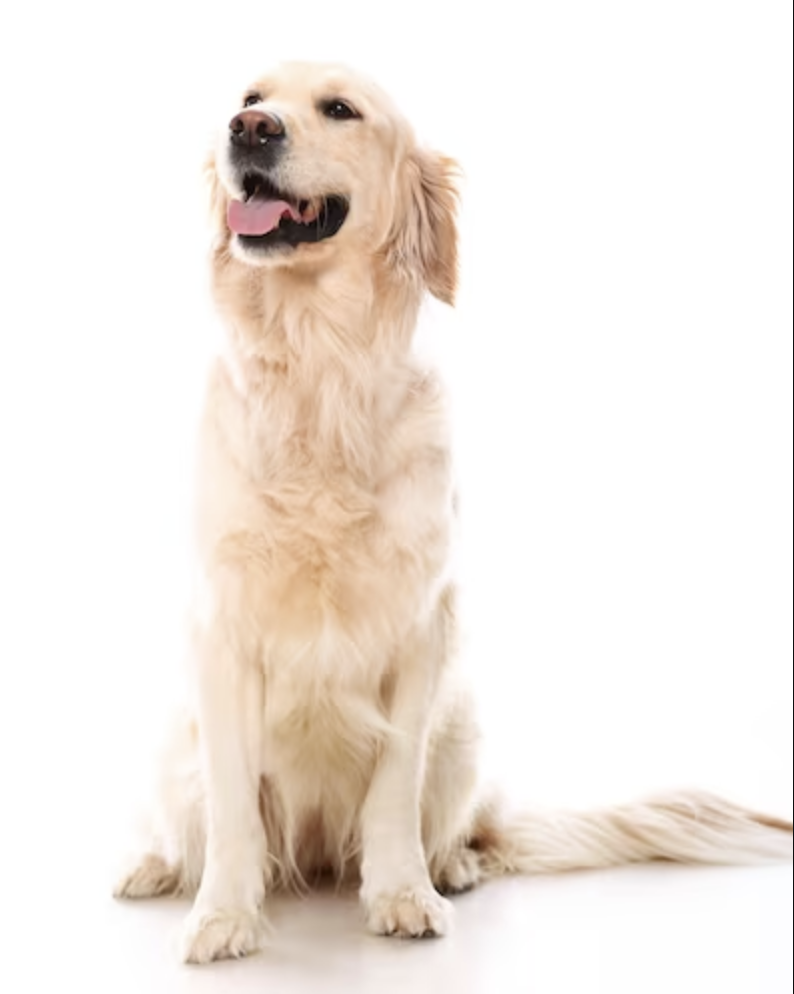

[Meal Train Planning](meal-train.md)

# Sample Blog Using Github Pages

[Getting started with GitHub pages](https://pages.github.com/)

## Sunday Feb 25 - Coca Cola

Today, Coca Cola officially won the Coke/Pepsi battle.

## Sunday Feb 3 - Not Quite Shake Shack

Nine days is a long time on liquids, but today was a great day. Not quite a Shake Shack day, but a great day.

## Random post by ChatGPT on Golden Retrievers

*Golden Retrievers* are beloved for their friendly and gentle nature, making them one of the most popular dog breeds worldwide. Known for their stunning golden coats and charming smiles, these dogs are often considered excellent family pets due to their patience and loyalty, especially around children. They excel in various roles, from being loyal companions to therapy dogs and even search and rescue operations, showcasing their versatility and intelligence.

Originally bred as hunting dogs in Scotland, Golden Retrievers possess a natural instinct for retrieving game, evidenced by their soft mouths and love for fetching objects. Their sociable temperament also makes them adept at forming strong bonds with their human families, often seeking attention and companionship. With proper training and socialization, Golden Retrievers thrive in various environments, bringing joy and companionship to countless households around the world.

